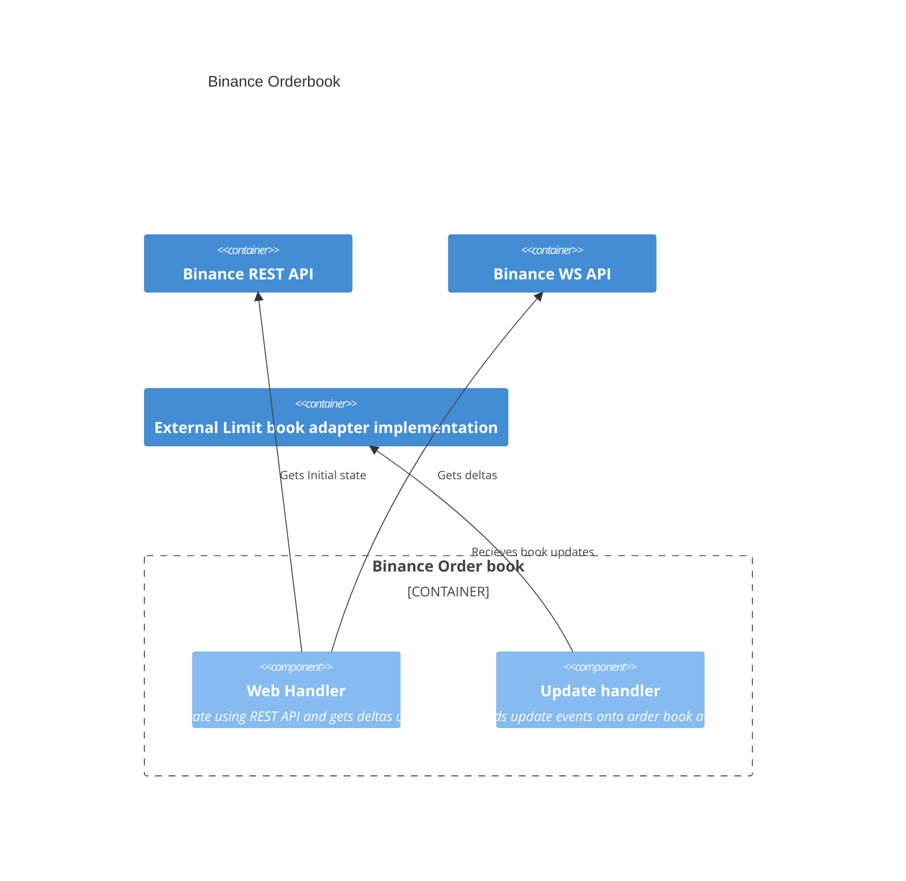

# Binance Orderbook
A C++20 real time limit order book using level 2 market data from binance. Provides an order book interface with adapters to integrate with industry standard financial libraries.
# Component Diagram (C4)
